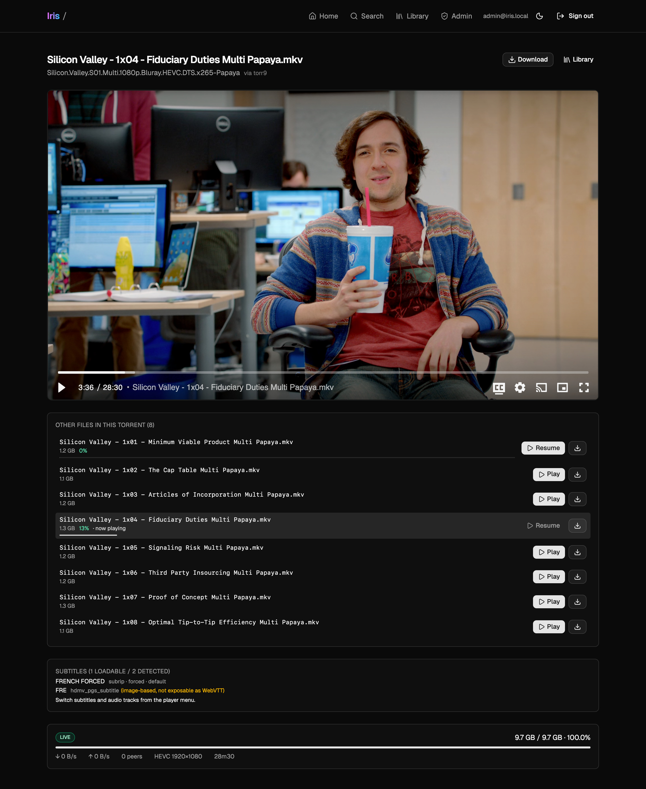

# Iris

Self-hosted "micro-Netflix": aggregate searches across torrent trackers, stream the result inside a React video player, seed the rest, and reclaim disk space when it runs low.



## Stack

- **Backend**: Rust 2024 workspace, Axum, SQLite (sqlx), librqbit, ffmpeg pipeline.
- **Frontend**: React 19 + Vite + Tailwind 4 + shadcn/ui, served by bun.
- **Auth**: invitation-only, JWT in HTTP-only cookies, argon2id passwords.

## Local dev

- Via host :

```sh
# 1. Backend
cp config/config.toml.example config/config.toml
# edit auth.jwt_secret + auth.bootstrap_admin
cargo run -p iris-api

# 2. Frontend (separate terminal)
cd web
bun install
bun run dev
# Vite dev server proxies /api -> http://localhost:8080
```

Visit http://localhost:5173, log in with the bootstrap admin, generate an
invitation in /admin, and use it from /register.

## Production (Docker)

```sh
cp .env.example .env
# fill everything
docker compose up --build -d
```
