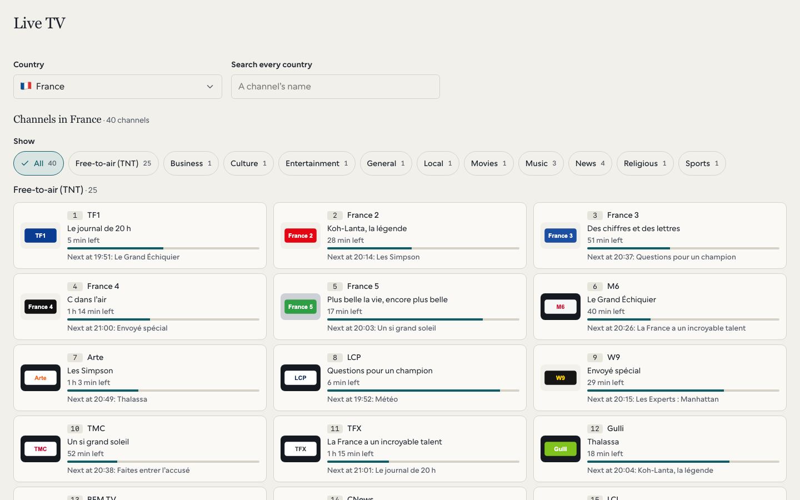
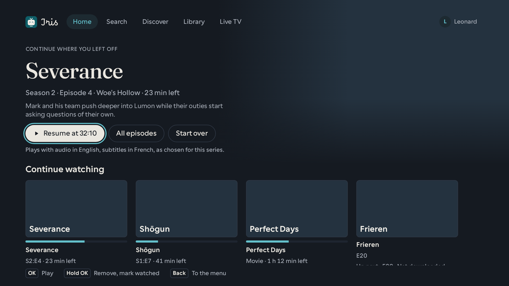

#  Iris

[](https://github.com/uplg/iris/actions/workflows/ci.yml)

A household's own streaming service. Iris searches the trackers you
belong to, plays a release while the torrent is still arriving, seeds
what you keep and frees the disk on its own when it fills up. One
server at home, a web app and an Android TV app; invitation-only.

<picture>
  <source media="(prefers-color-scheme: dark)" srcset="docs/screenshot-dark.png">
  
</picture>



## On the TV

1. Install **Downloader** (by AFTVNews) from the Play Store on the box.
2. Type the code **`8737385`**, or the address
   `https://synthe.se/app-release.apk`.
3. Install it (allow unknown sources for Downloader if the box asks).
4. Open Iris, give it your server's address, and pair: the TV shows a
   code, you confirm it on the web (Account → Devices).

Updates arrive in the app: a notice on the home screen when a new
version is out, "Update now", done. The same APK runs on Android
phones and tablets, touch included.

## What it does

- **Search** every tracker at once (Torznab, UNIT3D, and a few by
  hand), ranked, titles first: what you already have comes up on top.
- **Play now.** The web player picks its engine per file and per
  browser (native, MSE with a remux in the browser, WebCodecs, hevc.js,
  HLS from the server) so an MKV with HEVC, DTS and PGS subtitles plays
  without waiting for the download. The TV plays it with Media3 and its
  own decoders.
- **Series.** Follow a show, see its new episodes, get the next one in
  one press, in the language you watch it in.
- **Discover** what's out and what people watch, joined against what
  your trackers actually carry.
- **Live TV**: free-to-air channels per country with now and next,
  through a signed proxy, falling back across sources.
- **Seed and forget.** Finished torrents keep seeding; when the disk
  fills, the least watched go first. Your watch history stays.
- **The household**: invitations, passkeys or passwords, who's watching
  what right now, per-tracker switches, the audit log.

## Serve it

Docker on any always-on box. The bundled compose file publishes no HTTP
port: a Cloudflare tunnel (or the Caddy profile) reaches the server.

```console
$ cp .env.example .env              # JWT secret, public URL, tracker keys, TMDB key
$ cp config/config.toml.example config/config.toml
$ cp config/providers.toml.example config/providers.toml
$ just deploy                       # docker compose --profile cloudflared up --build -d
```

Sign in with the bootstrap admin from `.env`, make an invitation in
Admin, open it to create your account. The full walkthrough (rootless
Docker, the BitTorrent port, the tunnel, storage limits, upgrades) is
in [docs/DEPLOYMENT.md](docs/DEPLOYMENT.md).

## From source

```console
$ cargo run -p iris-api                  # the server, on :8080
$ cd web && bun install && bun run dev   # the web app, proxies /api to :8080
```

Or `just dev` for the whole thing in Docker on `127.0.0.1:8080`.
`just verify` is the full local gate: what CI runs (fmt, clippy with
zero warnings and tests for the server; the web app's checks, tests
and build) plus the release APK.
`cd web && bun run e2e` runs the playback bench: Chrome, Firefox and
WebKit against a real server and generated clips.

`just rehearsal-fetch` copies the production database (consistently,
while it runs) and `just rehearsal <copy>` serves it locally with no
torrent state, so nothing announces to a tracker: the place to try a
release on real data before deploying it.

### The Android TV app

Open `android-tv/` in Android Studio, or `just apk` (it generates the
Kotlin models from `web/openapi.json` first: nothing is hand-written on
either side of the API). Two things to know:

- The ffmpeg and AV1 decoders in `app/libs/` are native builds tied to
  the exact Media3 version: after a Media3 bump, `just tv-aars`.
- A release is two files, the APK and its version sidecar, which the
  update notice reads. `just apk-push` uploads both, the version taken
  from `versionName`.

Server, web and TV share one version; an older TV app keeps working
against a newer server (additive API only).

## Architecture

```
crates/iris-api         the server: Axum router, API, schedulers, live TV proxy
crates/iris-db          SQLite (sqlx): library, history, follows, sessions
crates/iris-providers   the trackers, behind one SearchProvider trait
crates/iris-torrent     librqbit: grabs, seeding, the disk GC
crates/iris-media       ffprobe, remux and HLS, subtitles, SCENE names
crates/iris-*           auth, config, client capabilities, shared types
web/                    SvelteKit (Svelte 5), Bits UI, TanStack Query
packages/iris-api       the generated API types, the client, the formatters
packages/iris-core      the player engine, framework-free
android-tv/             Compose for TV, Media3
migrations/             the schema, in order
```

## Standing on friendly shoulders

[librqbit](https://github.com/ikatson/rqbit) moves the bytes,
[FFmpeg](https://ffmpeg.org) and
[Shaka Packager](https://github.com/shaka-project/shaka-packager) cut
the streams, [Mediabunny](https://mediabunny.dev),
[hls.js](https://github.com/video-dev/hls.js),
[libav.js](https://github.com/Yahweasel/libav.js),
[hevc.js](https://www.npmjs.com/package/@hevcjs/core),
[libass](https://github.com/jellyfin/JavascriptSubtitlesOctopus) and
[libpgs](https://github.com/Arcus92/libpgs-js) play them in the browser,
[Media3](https://developer.android.com/media/media3) on the TV.
[iptv-org](https://github.com/iptv-org/iptv) and
[Free-TV](https://github.com/Free-TV/IPTV) list the channels.

This product uses the [TMDB](https://www.themoviedb.org) API but is not
endorsed or certified by TMDB. Anime data comes from
[AniList](https://anilist.co).

Fonts: Cal Sans and Borel (OFL 1.1), Fraunces (OFL 1.1).
